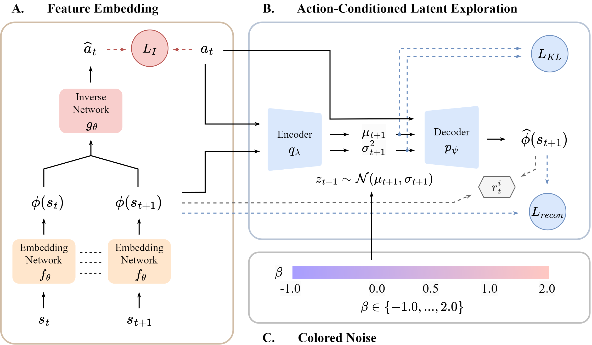

# A Temporally Correlated Latent Exploration for Reinforcement Learning

This repository contains the official implementation of **A Temporally Correlated Latent Exploration (TeCLE)**, a novel intrinsic reward formulation that employs an action-conditioned latent space and temporally correlated noise.



## Repository Layout

```
TeCLE_Submission/
├── atari/         # Atari orchestrator (run_atari.py)
├── robotics/      # Gym-Robotics / Fetch orchestrator (run_robotics.py)
├── shared/        # Shared training infrastructure and algorithm packages
│   ├── ppo_tecle/                          # TeCLE
│   ├── ppo, ppo_ama, ppo_disagree,
│   │   ppo_icm, ppo_noisy, ppo_noveld,
│   │   ppo_rnd                             # Baseline algorithms
│   ├── networks/                           # Policy / value / curiosity networks
│   └── *.py                                # main_loop, gym_env, checkpoint, schedule, etc.
├── minigrid/      # MiniGrid pipelines
│   ├── run_minigrid.py    # torch_ac-based (synchronous PPO/A2C)
│   └── NovelD/            # TorchBeast-based distributed baselines
│                          #   bebold / count / curiosity / rnd / ride / tecle / vanilla
├── README.md
├── TeCLE_atari.yaml      # Conda env for Atari (legacy gym 4-tuple API, minimal deps)
├── TeCLE_minigrid.yaml   # Conda env for MiniGrid (Atari env superset: + analysis/plotting/wandb deps)
└── TeCLE_robotics.yaml   # Conda env for Gym-Robotics (modern gymnasium 5-tuple API)
```

The `atari/` and `robotics/` orchestrators are thin wrappers — they set `PYTHONPATH` to `shared/` and dispatch to the per-algorithm entry script under `shared/<algo>/run_atari.py` or `shared/<algo>/run_mujoco.py`.

## Environment

- Ubuntu 20.04
- Python 3.10
- CUDA: `TeCLE_atari.yaml` / `TeCLE_minigrid.yaml` ship with PyTorch 2.0.1 + CUDA 11.7 (CUDA 12.x drivers are backwards compatible). `TeCLE_robotics.yaml` ships with PyTorch 2.10.0 + CUDA 12 build.

## Installation

The Atari/MiniGrid and Gym-Robotics pipelines target different Gym/Gymnasium step APIs (4-tuple vs. 5-tuple), so each has its own conda env. Within the legacy-API family, MiniGrid additionally requires analysis/plotting/wandb dependencies for heatmaps and run tracking, so it ships its own env. Create only the one(s) you need.

### Atari (legacy 4-tuple gym API)

```bash
conda env create -f TeCLE_atari.yaml
conda activate TeCLE_atari

# Download the Atari ROMs once.
AutoROM --accept-license
```

`TeCLE_atari.yaml` pins `gym==0.25.2`, `gymnasium==0.29.1`, `ale-py==0.7.5`, `minigrid==2.3.1`, `pytorch=2.0.1` (CUDA 11.7), Python 3.10. This env is sufficient for the `atari/` pipeline only.

### MiniGrid (legacy 4-tuple gym API, extended deps)

```bash
conda env create -f TeCLE_minigrid.yaml
conda activate TeCLE

# Install the local gym-minigrid source (required for MiniGrid).
cd minigrid/gym-minigrid && python setup.py install && cd ../../
```

`TeCLE_minigrid.yaml` (env name: `TeCLE`) is a superset of `TeCLE_atari.yaml`, adding `pandas`, `scipy`, `scikit-learn`, `matplotlib`, `seaborn`, `kornia`, `wandb`, `tensorflow` for heatmap visualization and experiment tracking used by `minigrid/run_minigrid.py` and the NovelD pipeline. If you only need the `atari/` pipeline, use `TeCLE_atari.yaml` instead.

### Gym-Robotics / Fetch (modern 5-tuple gymnasium API)

```bash
conda env create -f TeCLE_robotics.yaml
conda activate TeCLE_robotics
```

`TeCLE_robotics.yaml` pins `gymnasium==1.2.3`, `gymnasium-robotics==1.4.2`, `mujoco==3.5.0`, `ale-py==0.11.2`, `torch==2.10.0` (CUDA 12 build; swap to `--index-url https://download.pytorch.org/whl/cpu` for CPU-only), Python 3.13.

## MiniGrid: two pipelines, divided by RL paradigm

MiniGrid baselines are split across two co-located pipelines because the published numbers for some baselines were obtained under different training paradigms; re-implementing them under one paradigm would risk deviating from the literature.

| Pipeline | Paradigm | Use it for |
|---|---|---|
| `minigrid/run_minigrid.py` (torch_ac) | **Synchronous** on-policy: 16-env vector + single learner | TeCLE plus PPO-family comparisons (`a2c`, `ppo`, `icm`, `rnd_rev`) |
| `minigrid/NovelD/` (TorchBeast) | **Asynchronous** distributed actor-learner (IMPALA-style) | Faithful reproduction of NovelD, BeBold, RIDE, Count, Curiosity, RND, vanilla — and a paradigm-matched TeCLE re-implementation |

Run them independently for whichever baselines you need.

## Train TeCLE on MiniGrid (torch_ac pipeline)

```bash
cd minigrid
python run_minigrid.py --algorithms TeCLE --envs MiniGrid-DoorKey-8x8-v0 --seeds 1 --noise_beta 0.5 --heatmap
```

Available `--algorithms` choices: `TeCLE`, `ppo`, `a2c`, `icm`, `rnd_rev`. Available environments include `MiniGrid-Empty-8x8/16x16-v0`, `MiniGrid-DoorKey-8x8/16x16-v0`, `MiniGrid-KeyCorridorS3R3-v0`, `MiniGrid-Unlock-v0`, `MiniGrid-LavaCrossingS9N3/S11N5-v0`, `MiniGrid-MultiRoom-N2-S4-v0`. Other tunable flags: `--frames`, `--procs`, `--log-interval`, `--save-interval`, `--noisy_tv`. Logs and checkpoints are written to `minigrid/storage/` (created on first run).

## Train TeCLE on Atari

```bash
cd atari
python run_atari.py --algorithms ppo_tecle --envs BankHeist --seeds 1 --beta 0.5
```

Available `--algorithms` choices: `ppo_tecle`, `ppo`, `ppo_icm`, `ppo_rnd`, `ppo_noveld`, `ppo_ama`, `ppo_noisy`. Other tunable flags: `--num_iterations`, `--num_actors`, `--sticky`, `--load_checkpoint`. Logs and checkpoints are written to `atari/logs/` and `atari/checkpoints/`.

## Train TeCLE on Gym-Robotics (Fetch)

```bash
cd robotics
python run_robotics.py --algorithms ppo_tecle --envs FetchReach-v4 --seeds 1 --noise_beta 0.5
```

Available `--algorithms` choices: `ppo_tecle`, `ppo`, `ppo_icm`, `ppo_rnd`, `ppo_noveld`, `ppo_disagree`, `ppo_ama`, `ppo_noisy`. Other tunable flags: `--num_iterations`, `--num_actors`, `--load_checkpoint`. Logs and checkpoints are written to `robotics/logs/` and `robotics/checkpoints/`.

## Train NovelD-style baselines on MiniGrid (NovelD pipeline)

A NovelD-specific TeCLE re-implementation lives at `minigrid/NovelD/src/algos/tecle.py` for matched-condition comparison against the distributed baselines. The entry point is `main.py`:

```bash
cd minigrid/NovelD
pip install -r requirements.txt   # extra deps not in TeCLE.yaml
OMP_NUM_THREADS=1 python main.py --model bebold --env MiniGrid-KeyCorridorS3R3-v0 --total_frames 50000000
```

Available `--model` choices wired into `main.py`: `vanilla`, `count`, `curiosity`, `rnd`, `ride`, `bebold`. The matched-condition `tecle` algorithm exists at `src/algos/tecle.py` but requires manually adding a dispatch branch in `main.py` to invoke. Logs go to `minigrid/NovelD/experiments/`.

Note: `minigrid/NovelD/run.sh` is a sweep template adapted from the upstream NovelD `run.sh` for our experiments; some shell variables (`algo`, `noise_beta`, `frames`) must be exported by the caller before invocation, so prefer the direct `python main.py` invocation above.

## Optional: Custom Python Interpreter

The Atari and Robotics orchestrators default to the active `python` (i.e., `sys.executable`). To pin a specific interpreter (e.g. a separate conda env for these benchmarks), set the `RF_ENV_PYTHON` environment variable to the absolute path of the desired Python executable before launching.

## Acknowledgments / Code Attribution

This repository builds on several upstream open-source projects. License files are kept inside each derived directory; please consult them for exact terms before redistributing.

| Directory | Upstream | License |
|---|---|---|
| `shared/` | Deep RL Zoo — https://github.com/michaelnny/deep_rl_zoo | Apache 2.0 (see `shared/LICENSE`) |
| `minigrid/torch_ac/` | torch-ac by Lucas Willems — https://github.com/lcswillems/torch-ac | MIT (see `minigrid/torch_ac/LICENSE`) |
| `minigrid/gym-minigrid/` | Minigrid by Farama Foundation — https://github.com/Farama-Foundation/Minigrid | Apache 2.0 (see `minigrid/gym-minigrid/LICENSE`) |
| `minigrid/NovelD/` | NovelD by Facebook AI Research — https://github.com/tianjunz/NovelD | CC BY-NC 4.0 (see `minigrid/NovelD/LICENSE`) |

Modifications include: refactoring `shared/` into a single shared infrastructure consumed by `atari/` and `robotics/` orchestrators; adding the `ppo_tecle` algorithm package and its Gym-Robotics variant; consolidating two MiniGrid pipelines under `minigrid/`; orchestrator scripts (`run_atari.py`, `run_robotics.py`, `run_minigrid.py`) authored for this submission; adding a paradigm-matched TeCLE re-implementation at `minigrid/NovelD/src/algos/tecle.py`; and minor edits to other files in `minigrid/NovelD/src/` (algorithm hooks, sweep template, dead-code cleanup).

Note: `minigrid/NovelD/` also embeds an internal copy of `gym-minigrid/` at `minigrid/NovelD/src/gym-minigrid/`. That embedded copy is preserved verbatim from the upstream NovelD repository, and its LICENSE is retained alongside it.

## License

This repository (newly authored code: `ppo_tecle/`, `atari/run_atari.py`, `robotics/run_robotics.py`, `minigrid/run_minigrid.py`, and other orchestrator additions) is released under the **Apache License 2.0** (see top-level `LICENSE`).

> **⚠️ Non-commercial restriction on `minigrid/NovelD/`.** The `minigrid/NovelD/` directory is distributed under **CC BY-NC 4.0** (see `minigrid/NovelD/LICENSE`), which prohibits commercial use. Any commercial deployment must **exclude `minigrid/NovelD/`** from both the codebase and the runtime. The Apache 2.0, MIT, and Apache 2.0 licenses on `shared/`, `minigrid/torch_ac/`, and `minigrid/gym-minigrid/` respectively impose no such restriction.
